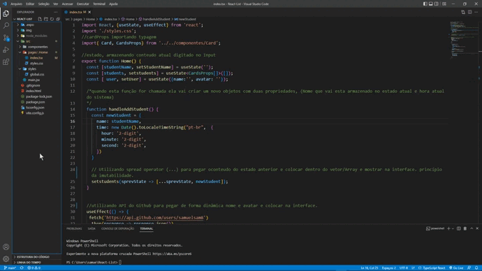

# React List

### Reaproveitando componentes e utilizando estado do React para armazenar nome digitado no Input e hora atual do Sistema.

### Consumindo API pública do GitHub para pegar nome e foto do perfil do usuário.

